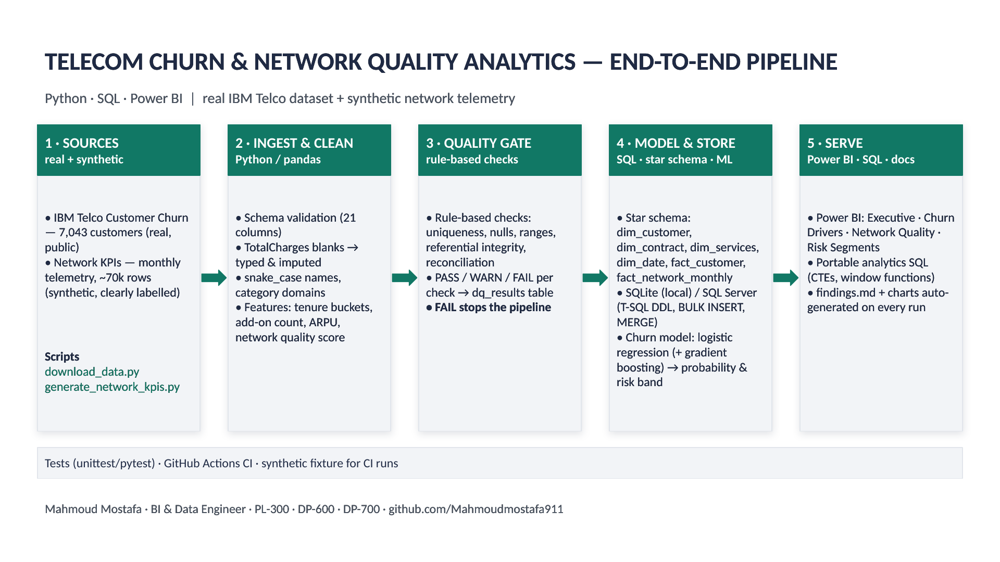
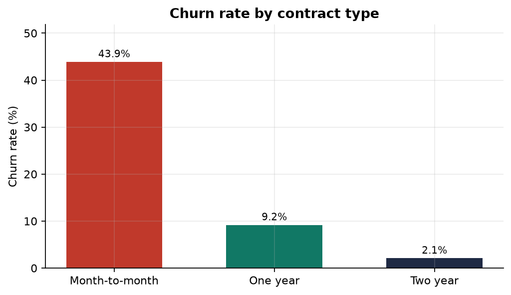
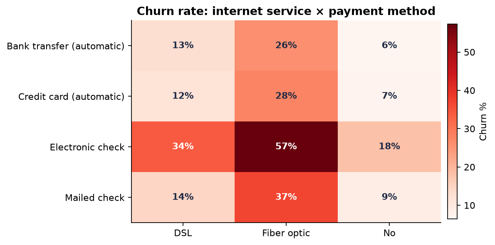
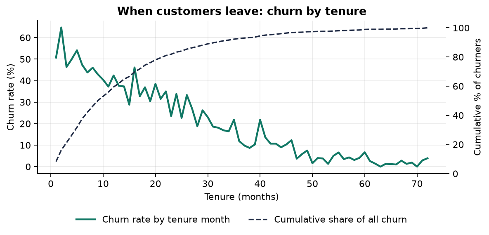
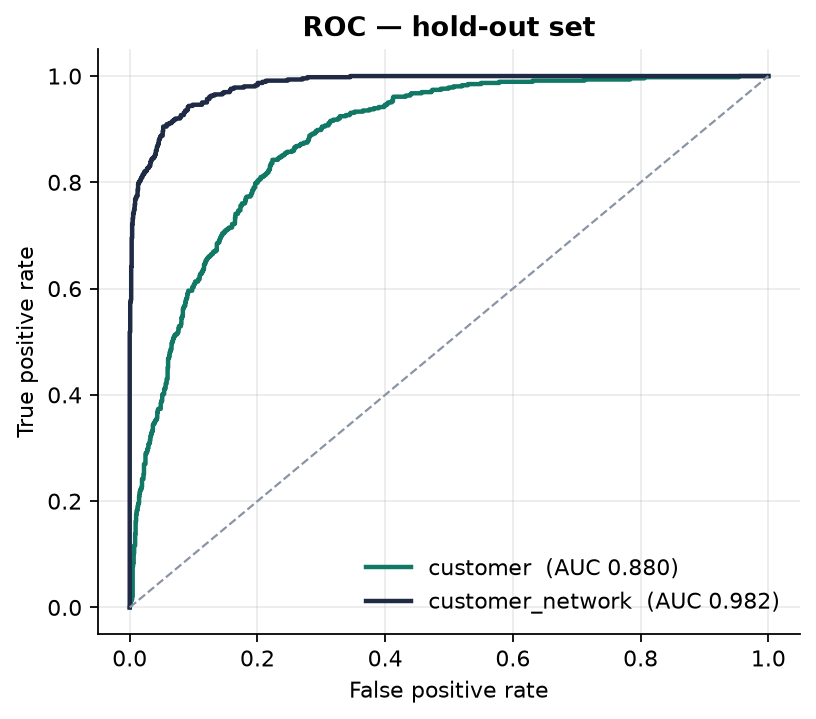
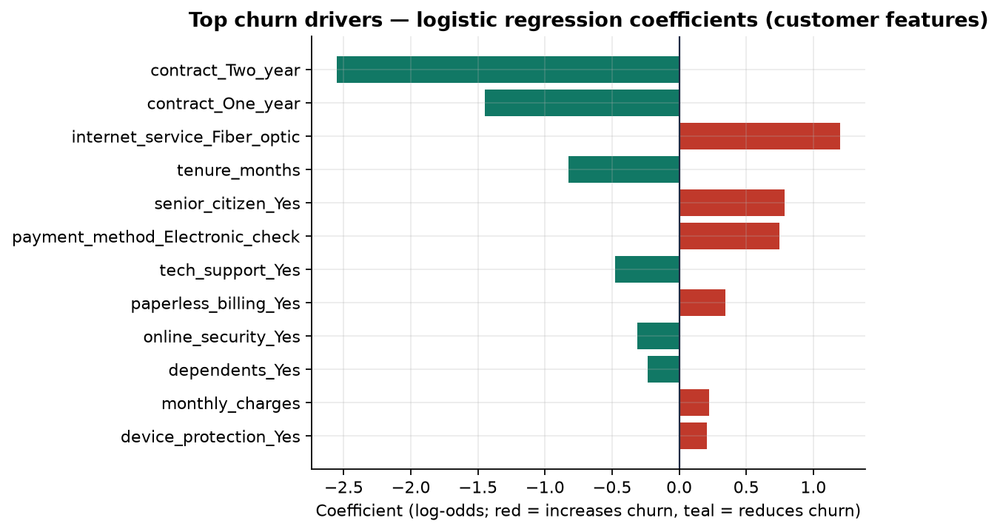
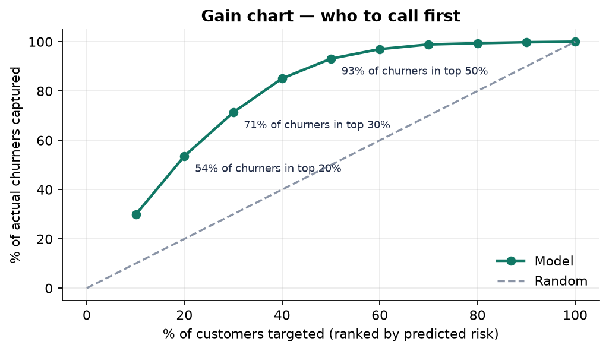
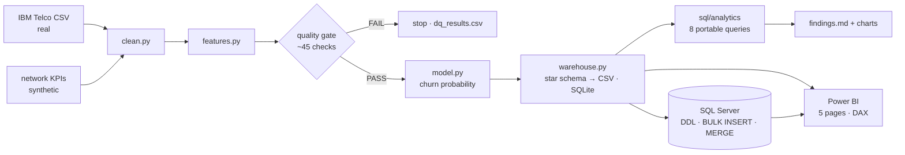

# Telecom Churn & Network Quality Analytics

[](https://github.com/Mahmoudmostafa911/telecom-churn-analytics/actions/workflows/ci.yml)


An end-to-end analytics project that answers the question every telecom asks —
**who is about to leave, why, and what is it costing us?** — using the real
IBM Telco Customer Churn dataset (7,043 customers) enriched with a synthetic
network-telemetry table, built the way a production pipeline would be:
schema contracts, a data-quality gate, a Kimball star schema, portable SQL,
an interpretable churn model and a Power BI model on top.



> **Honesty note.** The customer file is real. The monthly network KPIs are
> **synthetic** and were generated with a churn signal built in, so every
> telemetry chart and the `customer_network` model demonstrate *technique*,
> not a real-world finding. Real vs synthetic is labelled in file names,
> chart titles, `findings.md` and `model/metrics.json`.

---

## What the analysis shows (IBM dataset)

| Question | Answer | Where |
|---|---|---|
| How bad is churn? | ≈ 26–27 % of customers churned; they carried a disproportionate share of monthly recurring revenue because churners skew to higher-priced fiber plans | `01_churn_by_contract.sql`, `06_revenue_at_risk_by_decile.sql` |
| What drives it? | **Contract type** dominates: month-to-month ≈ 43 % vs two-year ≈ 3 %. **Fiber optic** (≈ 42 %) and **electronic-check payment** (≈ 45 %) are the next biggest flags; **tech support / online security** cut churn roughly in half among internet customers | `02…`, `04…`, `model/drivers_customer.csv` |
| When? | Roughly half of all churn happens in the first year; the hazard falls steadily with tenure | `03_tenure_curve.sql` |
| Who to call first? | The logistic model reaches **ROC-AUC ≈ 0.84–0.88** on hold-out data with real columns only; the top 30 % of customers by predicted risk contain ≈ 70 % of actual churners | `model/lift_customer.csv`, gain chart |
| Does network quality matter? | In the synthetic telemetry churners degrade in the last three months — the pipeline shows *how* to test this (monthly fact, trend features, technology-relative quality score) | `05…`, `07…` |

Exact figures for the last run are always in **[`docs/findings.md`](docs/findings.md)** — it is
regenerated by the pipeline and carries a banner saying whether it was built
from the real file or the synthetic fixture.

<p align="center">
  
  
</p>
<p align="center">
  
  
</p>
<p align="center">
  
  
</p>

---

## Pipeline in one picture



Full component table: [`docs/architecture.md`](docs/architecture.md).

## Quick start

```bash
git clone https://github.com/Mahmoudmostafa911/telecom-churn-analytics.git
cd telecom-churn-analytics
pip install -r requirements.txt            # pandas, numpy, matplotlib (+ scikit-learn, pytest, jupyter)

python data/download_data.py               # 1. real IBM file  -> data/raw/Telco-Customer-Churn.csv
python data/generate_network_kpis.py       # 2. synthetic telemetry -> data/raw/network_kpis_monthly.csv
PYTHONPATH=src python -m telco_churn run   # 3. everything else (≈ 15 s)
```

No internet? `make fixture && make run-fixture` builds a synthetic stand-in
with the same schema and runs the identical pipeline (this is what CI does).

Windows (PowerShell): `$env:PYTHONPATH="src"; python -m telco_churn run`.

Outputs land in `data/processed/` (star schema CSVs, `dq_results.csv`, `scores.csv`,
`telco_churn.sqlite`), `model/` (metrics, drivers, lift), `docs/img/` (charts) and
`docs/findings.md`.

## Repository layout

```
├── data/
│   ├── download_data.py            real IBM file (7,043 rows) with header + row-count verification
│   ├── generate_network_kpis.py    synthetic monthly telemetry, seeded, technology-aware
│   ├── make_synthetic_fixture.py   synthetic stand-in for CI/tests (same schema & quirks)
│   └── README.md                   provenance, schema, DQ rules, what is synthetic
├── src/telco_churn/
│   ├── config.py      schema contract, domains, ranges, bands        ├── model.py      logit + GBM, AUC/F1/lift, drivers
│   ├── ingest.py      typed loading, SchemaError                     ├── warehouse.py  star schema, SQLite, analytics runner
│   ├── clean.py       TotalCharges fix, conformance, CleaningReport  ├── charts.py     matplotlib figures
│   ├── features.py    customer + telemetry features, quality score   ├── report.py     findings.md generator
│   └── quality.py     declarative checks → dq_results                └── pipeline.py   CLI orchestration
├── sql/
│   ├── analytics/     8 business queries in portable SQL (SQLite + SQL Server)
│   └── sqlserver/     T-SQL DDL, BULK INSERT loader, MERGE refresh, Power BI views
├── model/             star_schema.md · dax_measures.md · report_layout.md · theme.json · metrics.json
├── notebooks/         01 EDA · 02 features & quality gate · 03 churn model
├── tests/             23 unit tests (unittest/pytest)
├── docs/              architecture.md · findings.md (generated) · data_dictionary.md · img/
└── .github/workflows/ci.yml   tests + full smoke run on the synthetic fixture
```

## Engineering highlights

**Schema contract & cleaning.** The raw header is enforced column-by-column.
`TotalCharges` arrives as text with 11 blank cells — all tenure-0 customers — and is
imputed as 0.0 with the count recorded in a `CleaningReport`, not silently dropped.

**Quality gate.** ~45 declarative checks (uniqueness, nulls, category domains, numeric
ranges, referential integrity between telemetry and customers, a
`total ≈ monthly × tenure` reconciliation, churn-rate plausibility). Every run writes
`dq_results.csv`; a FAIL stops the pipeline *after* the audit table is saved.

**Star schema.** `dim_customer`, `dim_contract` and `dim_services` (junk dimensions of
distinct attribute combinations), `dim_date`, a customer-snapshot fact and a monthly
telemetry fact — surrogate keys, ready for Power BI Import, SQL Server or a Fabric
Direct Lake model. See [`model/star_schema.md`](model/star_schema.md).

**Write SQL once.** The eight analytics queries use only the dialect-neutral subset
(CTEs, window functions, `NTILE`, `CASE`, `CAST`) so the *same file* runs in the
pipeline (SQLite) and in SSMS after the T-SQL scripts create the schema.

**Interpretable model.** Standardised logistic regression with odds-ratio driver table,
best-F1 threshold search, decile lift / gain chart and risk bands; gradient boosting
as a benchmark when scikit-learn is installed. A NumPy Newton–Raphson fallback keeps
the pipeline runnable in locked-down environments.

**Trust.** Unit tests for cleaning edge cases, feature logic, the quality gate and the
metrics; GitHub Actions runs them on Python 3.11 and 3.12 and then executes the whole
pipeline on the synthetic fixture.

## Power BI

`model/report_layout.md` describes a five-page report — Executive summary, Churn drivers
(Key Influencers + Decomposition Tree), Network quality, Retention targeting, Data
quality & lineage — with all measures in [`model/dax_measures.md`](model/dax_measures.md)
and a theme file. Load the star from `data/processed/star/` or from the SQL Server
views in `sql/sqlserver/04_views_for_power_bi.sql`.

<!-- TODO: add screenshots docs/img/pbi_page_1.png … once the .pbix is built -->

## How this maps to the certifications I hold

| Skill demonstrated | PL-300 | DP-600 | DP-700 |
|---|:-:|:-:|:-:|
| Star schema design, relationships, role of dimensions | ✔ | ✔ | |
| DAX measures incl. time intelligence and lift vs base | ✔ | ✔ | |
| Data cleaning, profiling and quality rules | ✔ | | ✔ |
| Transformation pipeline with a quality gate and audit table | | ✔ | ✔ |
| T-SQL DDL, `BULK INSERT`, `MERGE`, window functions | | ✔ | ✔ |
| Orchestration, CLI, tests, CI | | | ✔ |

## Roadmap

- [ ] Build the `.pbix`, add page screenshots to README
- [ ] Fabric notebook variant (Lakehouse `Files/` → Delta tables → Direct Lake model)
- [ ] Survival analysis (Kaplan–Meier / Cox) on tenure instead of a snapshot classifier
- [ ] Great Expectations-style YAML rule definitions for the quality gate

## Author

**Mahmoud Mostafa** — BI & Data Engineer · PL-300 · DP-600 · DP-700
[LinkedIn](https://www.linkedin.com/in/mahmoud-mostafa-bi-data/) · [GitHub](https://github.com/Mahmoudmostafa911)

Dataset: IBM Telco Customer Churn sample data, from the Apache-2.0 licensed repository
[IBM/telco-customer-churn-on-icp4d](https://github.com/IBM/telco-customer-churn-on-icp4d).
Code: MIT.
