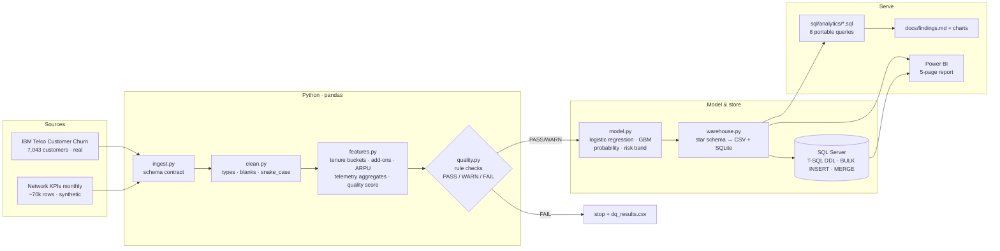

# Architecture

## Components

| Layer | Module / asset | Responsibility |
|---|---|---|
| Config | `src/telco_churn/config.py` | paths, schema contract (21 columns), category domains, numeric ranges, business bands |
| Ingest | `ingest.py` | read raw as text, enforce column contract (`SchemaError` on drift) |
| Clean | `clean.py` | `TotalCharges` blanks → 0.0 for tenure 0, 0/1 → Yes/No, snake_case, de-dup, `CleaningReport` |
| Features | `features.py` | tenure buckets, add-on count, auto-pay flag, lifetime ARPU & charge ratio, 12-m / last-3-m telemetry aggregates, trend deltas, technology-relative `network_quality_score` |
| Quality | `quality.py` | ~45 declarative checks → `dq_results` (audit table); FAIL raises `DataQualityError` |
| Model | `model.py` | stratified split, standardisation, logistic regression (sklearn or NumPy fallback), optional gradient boosting, AUC / F1 / lift, odds-ratio driver table, risk bands |
| Warehouse | `warehouse.py` | star schema (4 dims, 2 facts), CSV extracts, SQLite load, execution of portable analytics SQL |
| SQL Server | `sql/sqlserver/*.sql` | DDL with PK/FK/indexes, `BULK INSERT` loader, `MERGE` score refresh, Power BI views |
| Analytics | `sql/analytics/*.sql` | 8 business questions written once, run on SQLite **and** SQL Server |
| Serve | `charts.py`, `report.py`, `model/*.md` | PNG charts, `findings.md`, DAX measures, report layout, theme |
| Orchestration | `pipeline.py` | CLI, step timing, `run_manifest.json` |
| Trust | `tests/`, `.github/workflows/ci.yml` | 23 unit tests + smoke run of the full pipeline on the synthetic fixture on every push |

## Design principles

1. **Contract first.** The raw header is a hard contract; new columns are warned about, missing ones stop the run.
2. **Fail loudly, log everything.** The quality gate writes its audit table *before* raising, so a failed run still leaves evidence.
3. **Write SQL once.** Analytics queries use only the SQL subset shared by SQLite and SQL Server (CTEs, window functions, CASE, CAST — no TOP/LIMIT, no dialect-specific string ops).
4. **Honest about data.** Real vs synthetic is labelled in file names, banners, chart titles and the model report.
5. **Dependency-light.** pandas + numpy + matplotlib are enough to run everything; scikit-learn is optional.
6. **Portable to Fabric.** The star schema is Direct-Lake-ready; the notebooks translate to Fabric notebooks with a path change (`docs` → see `model/star_schema.md`).
