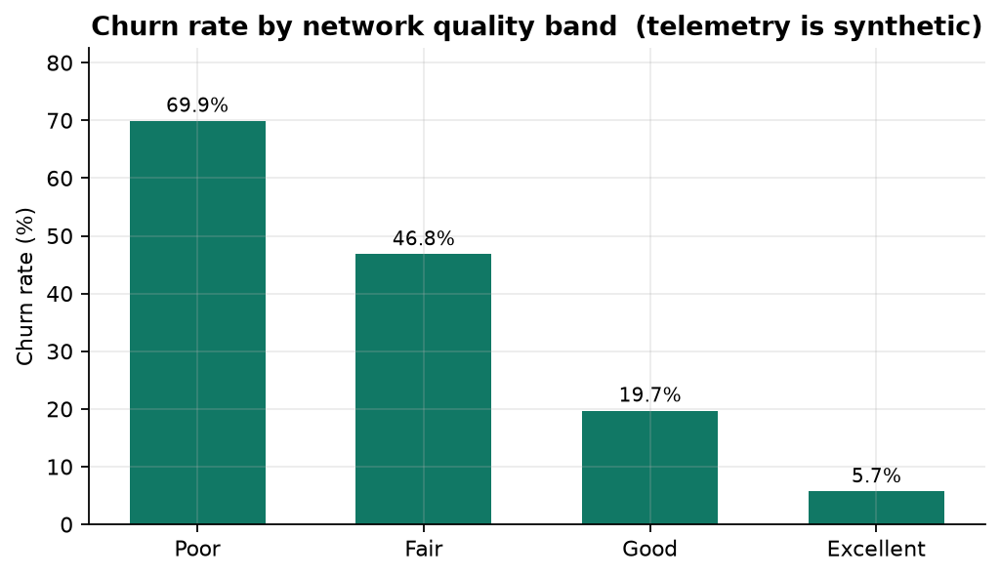
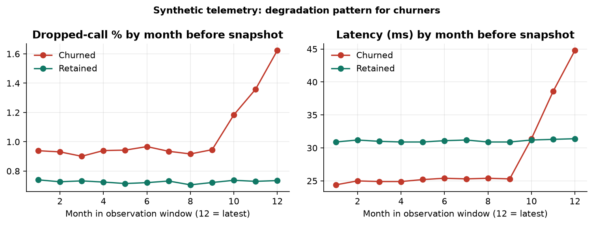

# Findings — Telecom Churn & Network Quality Analytics

_Generated 2026-09-27 10:19 UTC by `telco_churn.pipeline`._

> ⚠️ **Generated from the SYNTHETIC TEST FIXTURE** (`telco_synthetic_fixture.csv`). These numbers only prove the pipeline runs; they are *not* findings about real customers. Re-run on the IBM file to replace this document.

## Headline numbers

* **7,043 customers**, **1,852 churned** → overall churn rate **26.3%**.
* Churned customers represented **$139,301 of monthly recurring revenue**.
* Contract type is the sharpest split: **Month-to-month 43.9%** vs **Two year 2.1%**.

## Data quality

* Rows in → out: 7043 → 7043 (duplicates removed: 0).
* `TotalCharges` blank cells: **11** — all belong to tenure-0 customers and were imputed as 0.0 (11).
* Quality gate: **43 PASS / 0 WARN / 0 FAIL** across 43 checks (full log: `data/processed/dq_results.csv`).

## Churn by contract type

| contract | customers | churned | churn_rate_pct | avg_monthly_charges | monthly_revenue_lost | revenue_lost_pct |
|---|---|---|---|---|---|---|
| Month-to-month | 3831 | 1681 | 43.90 | 64.21 | 125,342.90 | 51.00 |
| One year | 1470 | 135 | 9.20 | 64.88 | 11,100.06 | 11.60 |
| Two year | 1742 | 36 | 2.10 | 64.61 | 2,858.49 | 2.50 |

_Query: `sql/analytics/01_churn_by_contract.sql`_

## Churn by internet service × payment method

| internet_service | payment_method | customers | churned | churn_rate_pct | share_of_base_pct | churn_rank |
|---|---|---|---|---|---|---|
| Fiber optic | Electronic check | 1028 | 589 | 57.30 | 14.60 | 1 |
| Fiber optic | Mailed check | 690 | 253 | 36.70 | 9.80 | 2 |
| DSL | Electronic check | 799 | 272 | 34.00 | 11.30 | 3 |
| Fiber optic | Credit card (automatic) | 661 | 182 | 27.50 | 9.40 | 4 |
| Fiber optic | Bank transfer (automatic) | 679 | 176 | 25.90 | 9.60 | 5 |
| No | Electronic check | 501 | 90 | 18.00 | 7.10 | 6 |
| DSL | Mailed check | 584 | 84 | 14.40 | 8.30 | 7 |
| DSL | Bank transfer (automatic) | 515 | 66 | 12.80 | 7.30 | 8 |
| DSL | Credit card (automatic) | 542 | 63 | 11.60 | 7.70 | 9 |
| No | Mailed check | 379 | 33 | 8.70 | 5.40 | 10 |
| No | Credit card (automatic) | 321 | 22 | 6.90 | 4.60 | 11 |
| No | Bank transfer (automatic) | 344 | 22 | 6.40 | 4.90 | 12 |

_Query: `sql/analytics/02_churn_by_internet_and_payment.sql`_

## Tenure curve (first 12 months shown)

| tenure_months | customers | churned | churn_rate_pct | cumulative_churned | cumulative_churn_share_pct |
|---|---|---|---|---|---|
| 0.00 | 11.00 | 3.00 | 27.30 | 3.00 | 0.20 |
| 1.00 | 296.00 | 150.00 | 50.70 | 153.00 | 8.30 |
| 2.00 | 224.00 | 145.00 | 64.70 | 298.00 | 16.10 |
| 3.00 | 205.00 | 95.00 | 46.30 | 393.00 | 21.20 |
| 4.00 | 192.00 | 96.00 | 50.00 | 489.00 | 26.40 |
| 5.00 | 185.00 | 100.00 | 54.10 | 589.00 | 31.80 |
| 6.00 | 226.00 | 107.00 | 47.30 | 696.00 | 37.60 |
| 7.00 | 192.00 | 84.00 | 43.80 | 780.00 | 42.10 |
| 8.00 | 163.00 | 75.00 | 46.00 | 855.00 | 46.20 |
| 9.00 | 168.00 | 72.00 | 42.90 | 927.00 | 50.10 |
| 10.00 | 136.00 | 55.00 | 40.40 | 982.00 | 53.00 |
| 11.00 | 145.00 | 54.00 | 37.20 | 1,036.00 | 55.90 |

_Query: `sql/analytics/03_tenure_curve.sql`_

## Add-on services and tech support (internet customers)

| analysis | segment | customers | churn_rate_pct | avg_monthly_charges |
|---|---|---|---|---|
| By add-on count | 0 | 176 | 35.20 | 57.09 |
| By add-on count | 1 | 808 | 34.50 | 65.71 |
| By add-on count | 2 | 1616 | 30.60 | 72.83 |
| By add-on count | 3 | 1687 | 29.90 | 79.18 |
| By add-on count | 4 | 891 | 30.80 | 86.27 |
| By add-on count | 5 | 287 | 23.30 | 91.34 |
| By add-on count | 6 | 33 | 15.20 | 92.91 |
| By tech support | No | 3494 | 34.90 | 76.47 |
| By tech support | Yes | 2004 | 23.30 | 76.53 |

_Query: `sql/analytics/04_addon_services_effect.sql`_

## Revenue at risk by monthly-charge decile

| charge_decile | customers | min_monthly | max_monthly | churn_rate_pct | monthly_revenue_lost | share_of_lost_revenue_pct |
|---|---|---|---|---|---|---|
| 1.00 | 705.00 | 18.25 | 20.64 | 8.40 | 1,113.95 | 0.80 |
| 2.00 | 705.00 | 20.66 | 26.13 | 12.60 | 2,080.72 | 1.50 |
| 3.00 | 705.00 | 26.13 | 54.13 | 19.70 | 6,052.88 | 4.30 |
| 4.00 | 704.00 | 54.14 | 62.20 | 21.40 | 8,782.35 | 6.30 |
| 5.00 | 704.00 | 62.20 | 69.06 | 23.90 | 11,025.47 | 7.90 |
| 6.00 | 704.00 | 69.06 | 76.62 | 26.40 | 13,607.39 | 9.80 |
| 7.00 | 704.00 | 76.62 | 84.40 | 35.70 | 20,213.56 | 14.50 |
| 8.00 | 704.00 | 84.41 | 90.41 | 35.20 | 21,707.07 | 15.60 |
| 9.00 | 704.00 | 90.42 | 96.70 | 39.80 | 26,146.77 | 18.80 |
| 10.00 | 704.00 | 96.72 | 117.54 | 39.90 | 28,571.29 | 20.50 |

_Query: `sql/analytics/06_revenue_at_risk_by_decile.sql`_

## Network quality vs churn — ⚠️ synthetic telemetry

| network_quality_band | customers | churned | churn_rate_pct | avg_quality_score | avg_dropped_call_pct | avg_latency_ms | avg_outage_minutes | avg_complaints |
|---|---|---|---|---|---|---|---|---|
| Poor | 386 | 270 | 69.90 | 48.60 | 1.63 | 55.10 | 241.00 | 1.47 |
| Fair | 1901 | 890 | 46.80 | 64.20 | 1.06 | 38.30 | 175.00 | 0.92 |
| Good | 2995 | 591 | 19.70 | 76.20 | 0.75 | 27.20 | 124.00 | 0.46 |
| Excellent | 1761 | 101 | 5.70 | 87.30 | 0.60 | 20.20 | 63.00 | 0.07 |

_Query: `sql/analytics/05_network_quality_vs_churn.sql`_

## Network trend before churn — ⚠️ synthetic telemetry

| month | month_index | customer_group | customer_months | avg_dropped_call_pct | avg_latency_ms | avg_download_mbps | avg_outage_minutes | avg_complaints |
|---|---|---|---|---|---|---|---|---|
| 2025-01 | 1 | Churned | 816 | 0.94 | 24.40 | 148.70 | 11.80 | 0.03 |
| 2025-01 | 1 | Retained | 4084 | 0.74 | 30.90 | 108.80 | 12.10 | 0.04 |
| 2025-02 | 2 | Churned | 870 | 0.93 | 25.00 | 147.80 | 11.90 | 0.05 |
| 2025-02 | 2 | Retained | 4175 | 0.73 | 31.20 | 109.80 | 12.20 | 0.03 |
| 2025-03 | 3 | Churned | 925 | 0.90 | 24.90 | 146.90 | 12.00 | 0.04 |
| 2025-03 | 3 | Retained | 4256 | 0.73 | 31.00 | 108.60 | 12.20 | 0.04 |
| 2025-04 | 4 | Churned | 997 | 0.94 | 24.90 | 147.30 | 11.80 | 0.03 |
| 2025-04 | 4 | Retained | 4352 | 0.72 | 30.90 | 108.40 | 12.20 | 0.04 |
| 2025-05 | 5 | Churned | 1072 | 0.94 | 25.20 | 146.20 | 11.90 | 0.04 |
| 2025-05 | 5 | Retained | 4440 | 0.71 | 30.90 | 109.00 | 12.10 | 0.04 |
| 2025-06 | 6 | Churned | 1156 | 0.97 | 25.40 | 146.10 | 11.70 | 0.04 |
| 2025-06 | 6 | Retained | 4548 | 0.72 | 31.10 | 108.10 | 12.10 | 0.04 |
| 2025-07 | 7 | Churned | 1263 | 0.94 | 25.30 | 147.70 | 11.90 | 0.03 |
| 2025-07 | 7 | Retained | 4667 | 0.73 | 31.20 | 106.90 | 12.10 | 0.04 |
| 2025-08 | 8 | Churned | 1363 | 0.92 | 25.40 | 145.10 | 12.00 | 0.04 |
| 2025-08 | 8 | Retained | 4752 | 0.71 | 30.90 | 106.80 | 12.10 | 0.04 |
| 2025-09 | 9 | Churned | 1459 | 0.95 | 25.30 | 146.70 | 11.90 | 0.05 |
| 2025-09 | 9 | Retained | 4848 | 0.72 | 30.90 | 106.60 | 12.10 | 0.04 |
| 2025-10 | 10 | Churned | 1554 | 1.18 | 31.40 | 137.00 | 23.60 | 0.27 |
| 2025-10 | 10 | Retained | 4958 | 0.74 | 31.20 | 106.10 | 12.10 | 0.04 |
| 2025-11 | 11 | Churned | 1699 | 1.36 | 38.60 | 125.90 | 23.70 | 0.25 |
| 2025-11 | 11 | Retained | 5037 | 0.73 | 31.30 | 105.50 | 12.00 | 0.04 |
| 2025-12 | 12 | Churned | 1852 | 1.62 | 44.80 | 116.20 | 23.80 | 0.24 |
| 2025-12 | 12 | Retained | 5191 | 0.73 | 31.40 | 105.40 | 12.10 | 0.04 |

_Query: `sql/analytics/07_network_trend_churned_vs_retained.sql`_

## Model risk segments × contract

| risk_band | contract | customers | actual_churn_rate_pct | avg_predicted_probability | monthly_revenue | expected_monthly_revenue_at_risk |
|---|---|---|---|---|---|---|
| High | Month-to-month | 1562 | 70.60 | 0.70 | 130,643.01 | 92,695.51 |
| High | One year | 15 | 60.00 | 0.59 | 1,270.37 | 749.22 |
| High | Two year | 1 | 0.00 | 0.52 | 82.03 | 42.52 |
| Medium | Month-to-month | 1390 | 33.70 | 0.34 | 80,565.37 | 27,979.47 |
| Medium | One year | 191 | 32.50 | 0.30 | 16,882.18 | 5,005.45 |
| Medium | Two year | 17 | 23.50 | 0.26 | 1,548.97 | 402.97 |
| Low | Month-to-month | 879 | 12.60 | 0.12 | 34,793.35 | 4,381.47 |
| Low | One year | 1264 | 5.10 | 0.06 | 77,223.42 | 5,149.27 |
| Low | Two year | 1724 | 1.90 | 0.02 | 110,928.21 | 2,647.42 |

_Query: `sql/analytics/08_risk_segments.sql`_

## Churn model

| feature set | engine | AUC (test) | F1 @0.5 | recall @0.5 | best-F1 threshold | F1 @best |
|---|---|---|---|---|---|---|
| customer | numpy.NewtonRaphsonLogit | 0.88 | 0.64 | 0.60 | 0.26 | 0.68 |
| customer_network | numpy.NewtonRaphsonLogit | 0.98 | 0.87 | 0.85 | 0.36 | 0.88 |

> The **customer** feature set is the honest benchmark (real columns only). **customer_network** adds synthetic telemetry that was generated with a churn signal built in, so its extra lift is illustrative.

### Top drivers (customer features)

| feature | coefficient | odds_ratio | type | direction |
|---|---|---|---|---|
| contract_Two_year | -2.55 | 0.08 | one-hot vs baseline | reduces churn |
| contract_One_year | -1.45 | 0.23 | one-hot vs baseline | reduces churn |
| internet_service_Fiber_optic | 1.20 | 3.32 | one-hot vs baseline | increases churn |
| tenure_months | -0.82 | 0.44 | numeric (per 1 SD) | reduces churn |
| senior_citizen_Yes | 0.78 | 2.19 | one-hot vs baseline | increases churn |
| payment_method_Electronic_check | 0.75 | 2.11 | one-hot vs baseline | increases churn |
| tech_support_Yes | -0.48 | 0.62 | one-hot vs baseline | reduces churn |
| paperless_billing_Yes | 0.35 | 1.41 | one-hot vs baseline | increases churn |
| online_security_Yes | -0.31 | 0.73 | one-hot vs baseline | reduces churn |
| dependents_Yes | -0.23 | 0.79 | one-hot vs baseline | reduces churn |
| monthly_charges | 0.23 | 1.25 | numeric (per 1 SD) | increases churn |
| device_protection_Yes | 0.21 | 1.23 | one-hot vs baseline | increases churn |

### Gain chart (customer features)

| decile | customers | churners | min_probability | max_probability | churn_rate | lift | cumulative_churners_pct | cumulative_customers_pct |
|---|---|---|---|---|---|---|---|---|
| 1.00 | 177.00 | 139.00 | 0.73 | 0.94 | 0.79 | 2.99 | 30.00 | 10.10 |
| 2.00 | 176.00 | 109.00 | 0.55 | 0.73 | 0.62 | 2.36 | 53.60 | 20.00 |
| 3.00 | 176.00 | 82.00 | 0.37 | 0.54 | 0.47 | 1.77 | 71.30 | 30.00 |
| 4.00 | 176.00 | 64.00 | 0.25 | 0.37 | 0.36 | 1.38 | 85.10 | 40.00 |
| 5.00 | 176.00 | 37.00 | 0.15 | 0.25 | 0.21 | 0.80 | 93.10 | 50.00 |
| 6.00 | 176.00 | 18.00 | 0.08 | 0.15 | 0.10 | 0.39 | 97.00 | 60.00 |
| 7.00 | 176.00 | 9.00 | 0.03 | 0.08 | 0.05 | 0.19 | 98.90 | 70.00 |
| 8.00 | 176.00 | 2.00 | 0.01 | 0.03 | 0.01 | 0.04 | 99.40 | 80.00 |
| 9.00 | 176.00 | 2.00 | 0.01 | 0.01 | 0.01 | 0.04 | 99.80 | 90.00 |
| 10.00 | 176.00 | 1.00 | 0.00 | 0.01 | 0.01 | 0.02 | 100.00 | 100.00 |
