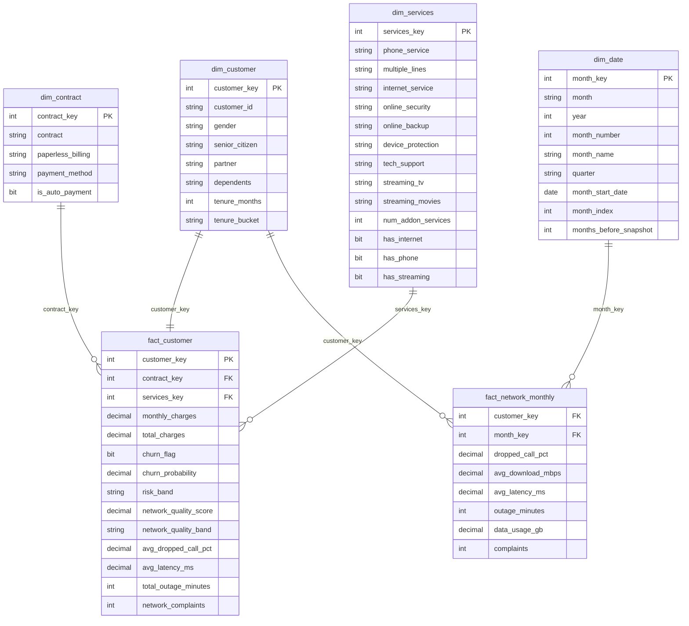

# Star schema & Power BI model

The pipeline writes the model as CSV (`data/processed/star/`) and SQLite; the
T-SQL scripts recreate it on SQL Server. Power BI can import either the CSVs
or the SQL Server views.

## Design notes

| Decision | Why |
|---|---|
| `fact_customer` is a **snapshot fact** (grain = 1 customer) | The IBM file is a point-in-time extract; churn is an attribute of the snapshot, not an event stream. |
| `dim_contract` and `dim_services` are **junk dimensions** of distinct attribute combinations (24 and ~380 rows) | Keeps the fact narrow; slicers stay fast; avoids 16 boolean columns on the fact. |
| `dim_customer` has a 1:1 relationship with `fact_customer` | Demographics are descriptive, measures live on the fact — the split keeps a clean dimensional vocabulary and lets `fact_network_monthly` reuse the same customer key. |
| Network aggregates are **denormalised onto `fact_customer`** *and* kept at monthly grain in `fact_network_monthly` | Customer-level slicing without a DAX aggregation cost; monthly trend analysis when needed. |
| Surrogate integer keys everywhere | Cheaper joins/compression; the business key `customer_id` stays on both fact and dimension for tracing. |
| Model scores stored on the fact (`churn_probability`, `risk_band`) | Refreshed via `MERGE` (`sql/sqlserver/03_merge_refresh_scores.sql`) without rebuilding the table. |

## Relationships in Power BI

| From (many) | To (one) | Cardinality | Filter direction |
|---|---|---|---|
| `fact_customer[contract_key]` | `dim_contract[contract_key]` | many-to-one | single |
| `fact_customer[services_key]` | `dim_services[services_key]` | many-to-one | single |
| `fact_customer[customer_key]` | `dim_customer[customer_key]` | one-to-one | both (or make `dim_customer` the filter side) |
| `fact_network_monthly[customer_key]` | `dim_customer[customer_key]` | many-to-one | single |
| `fact_network_monthly[month_key]` | `dim_date[month_key]` | many-to-one | single |

Mark `dim_date` as the date table using `month_start_date`. Hide all key
columns and the `customer_id` copy on the facts.

## Loading options

1. **CSV import** — Get Data ▸ Folder ▸ `data/processed/star/` (fastest way to a first .pbix).
2. **SQL Server** — run `sql/sqlserver/01…04` then connect to `TelcoChurn`, import `vw_customer_360`
   and `vw_network_monthly` (or the base tables for a proper star).
3. **Microsoft Fabric** — upload the CSVs to a Lakehouse `Files/` area, load them to Delta tables
   with a notebook (`spark.read.csv(...).write.saveAsTable(...)`) and build a Direct Lake semantic
   model. The star is Fabric-ready as-is.
